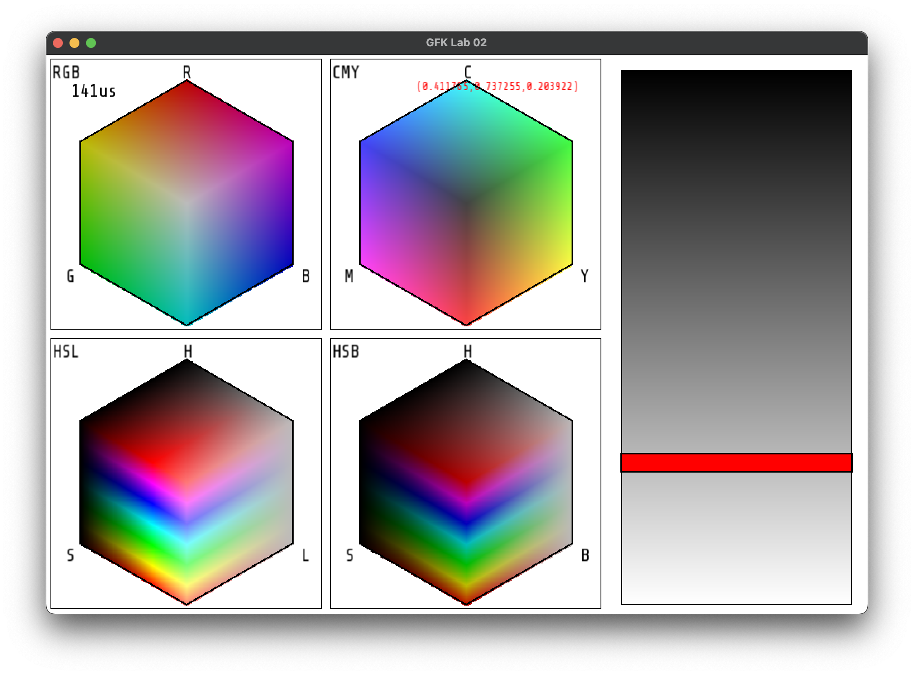
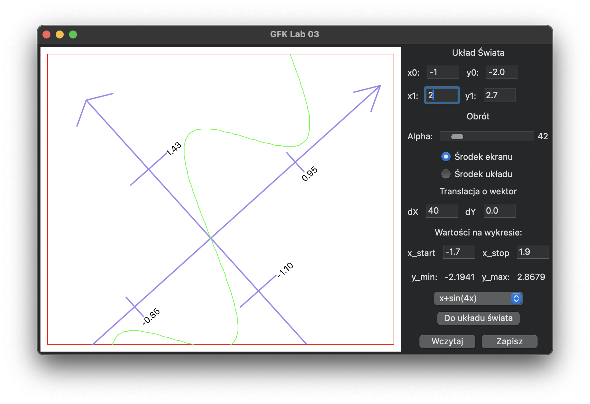
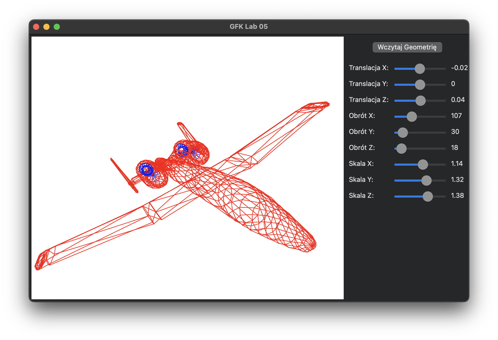
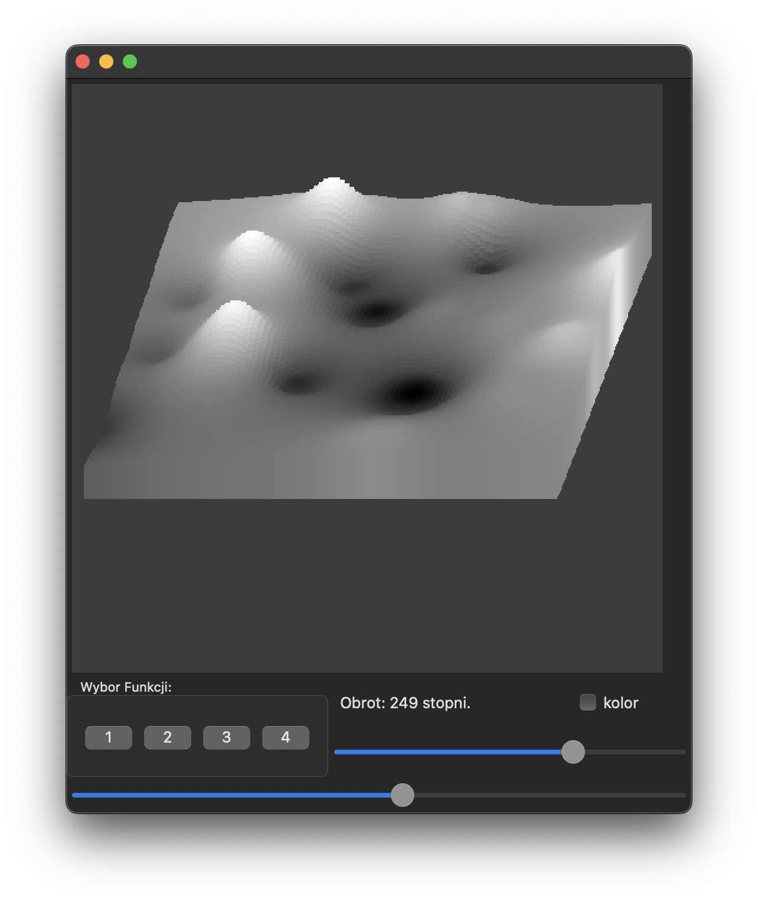
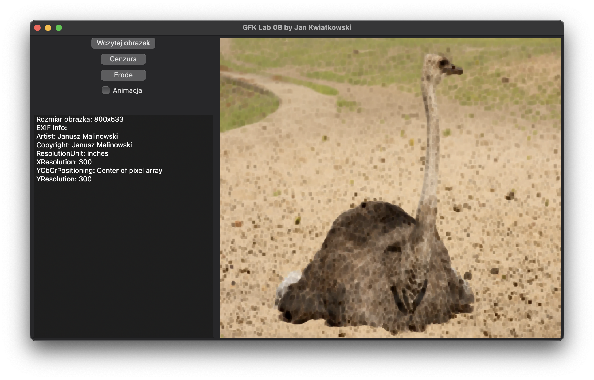

# Fundamentals of Computer Graphics

This repo contains the solutions to certain tasks from the "Fundamentals of Computer Graphics" course.

Some of the code was given and I had to make some adaptations, thus the quality of it might be rather poor.

## Screenshots

### lab2

### lab4

### lab5

### lab6

### lab7

### lab8

